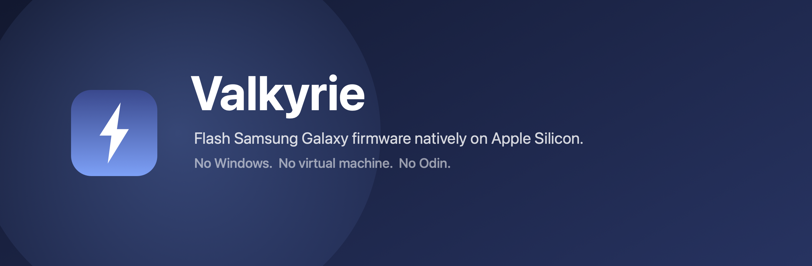
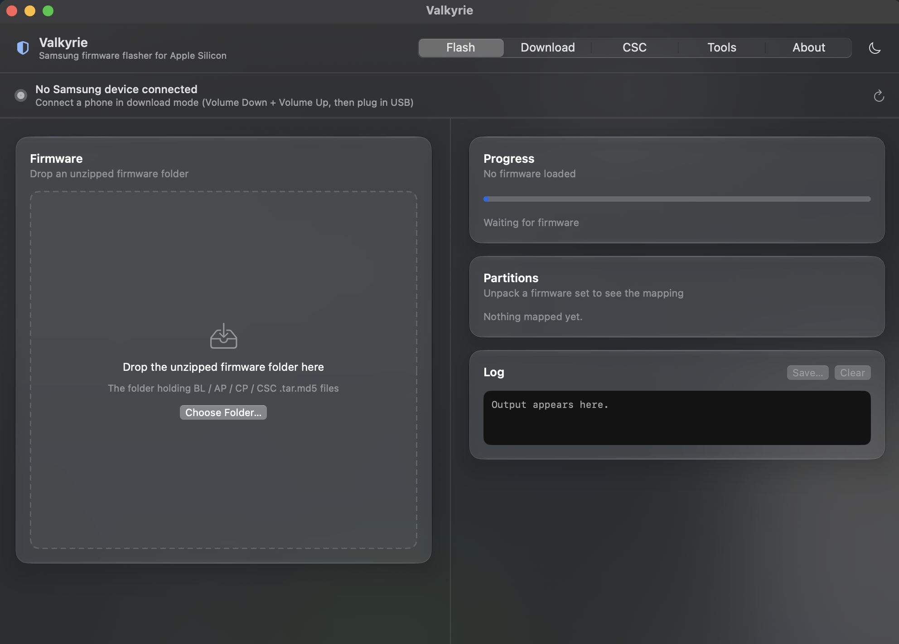
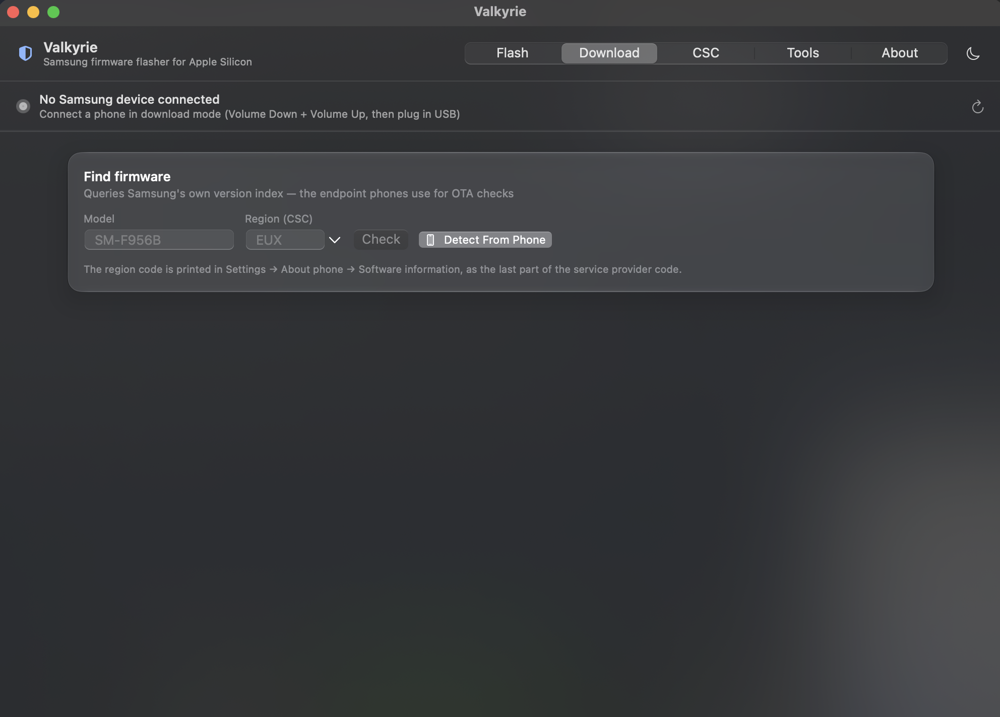
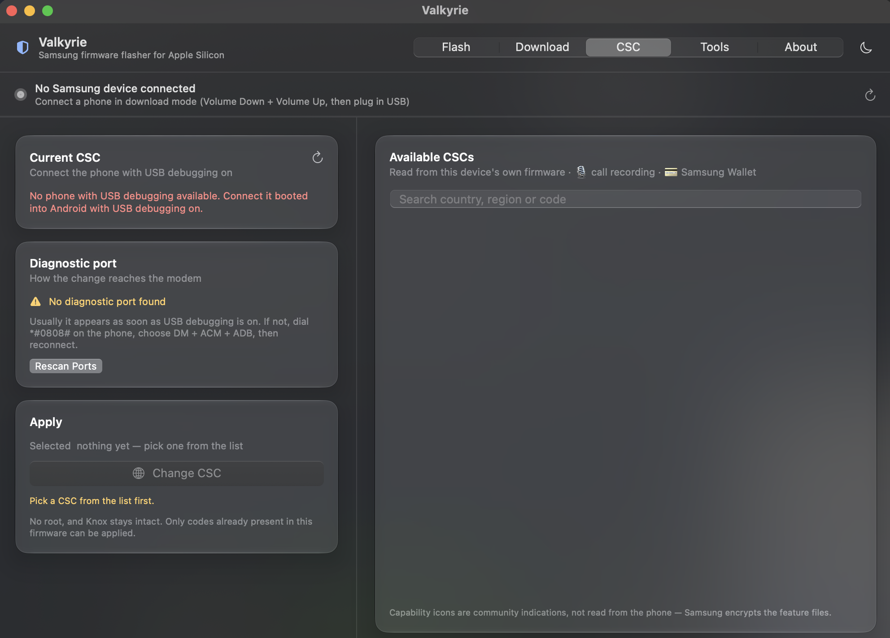
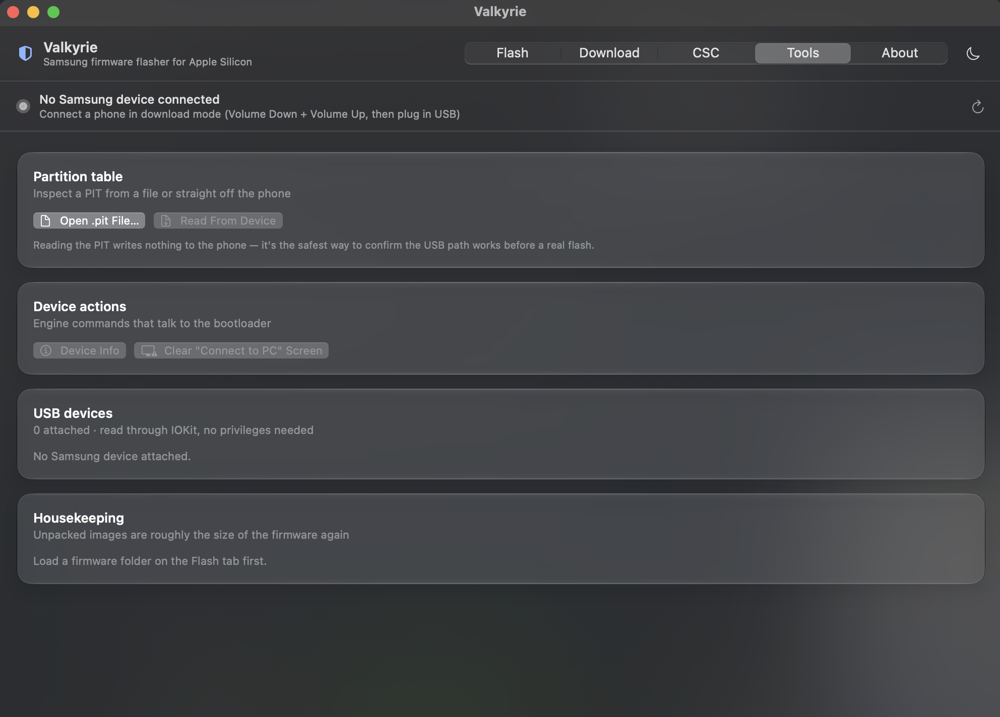
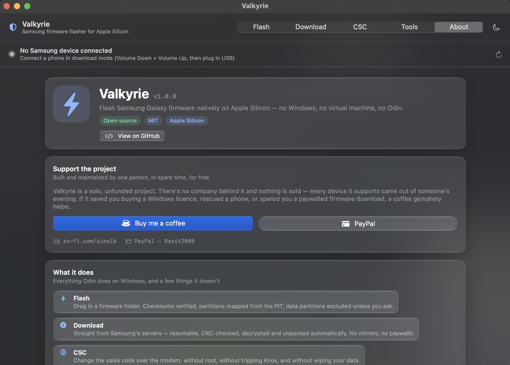

<p align="center">
  
</p>

<p align="center">
  <a href="https://github.com/hashtagbasit/valkyrie/releases"></a>
  
  
  
  <a href="https://ko-fi.com/aimalb"></a>
</p>

---

Odin is Windows-only and looks its age. Heimdall works on macOS but is a command line tool.
**Valkyrie** is a native macOS app built on top of
[heimdall-apple-silicon](https://github.com/aljosasavic/heimdall-apple-silicon), so a full
stock firmware flash — download, verify, decrypt, unpack, write — is a drag-and-drop
operation on an M-series Mac.

It also does two things Odin cannot: it **downloads firmware straight from Samsung's
servers**, and it **changes the CSC without root, without tripping Knox, and without
wiping your data**.

> ⚠️ Flashing firmware can wipe data and, if interrupted, can brick a device. Use firmware
> built for your exact model, don't unplug mid-flash, and proceed at your own risk.

<p align="center">
  
</p>

## What it does

**Flash**
- Drop in an unzipped firmware folder — BL / AP / CP / CSC are detected automatically
- Picks `HOME_CSC` over `CSC` by default, so a flash keeps user data unless you say otherwise
- Unpacks the tarballs and lz4-decompresses every partition image for you
- Reads the PIT **binary directly** to map each image to its partition
- Live per-partition progress, with the partition currently being written highlighted
- Odin's option checkboxes: auto-reboot, re-partition, T-Flash, skip size check

**Download**
- Looks up the current firmware for any model and region from Samsung's own version index
- Shows the AP / CSC / CP triple, the Android version, and every earlier build still listed
- Downloads the firmware **directly from Samsung's servers** — no mirror, no paywall, no
  throttling, and no separate tool
- Decrypts the `.enc4` archive locally as part of the same operation
- Resumes an interrupted transfer from whatever is already on disk

**Throughout**
- Light and dark appearance, following the system or pinned to either from the title bar

**CSC**
- Reads the current sales code and confirms it against the modem, not just Android
- Lists every code in your firmware with country and region, read from the device itself
- Changes the CSC over the modem's AT interface — **no root, no Knox trip, no data loss**
- Restarts the phone and verifies the new code actually applied

**Tools**
- PIT inspector — open a `.pit` file, or read the table off the connected phone
- Reading the PIT writes nothing, so it's the safest way to prove the USB path works
- Live USB device list, and a one-click cleanup for the unpacked images

## Design notes

**Device detection needs no password.** The USB tree is read through IOKit, so Valkyrie
shows live connection state from launch. Only the flash itself needs root.

**One password prompt, not many.** libusb has to claim the USB interface to talk to the
bootloader, and macOS only allows that as root. Valkyrie validates your password once to
warm `sudo`'s timestamp; every later call runs `sudo -n`, which cannot prompt and so
cannot hang the app waiting on a terminal. The password is never stored.

**Progress is real, not faked.** Heimdall only flushes output when it thinks it's
attached to a terminal, and it repaints its percentage with backspaces (`0%`, then
`\b\b45%`). Valkyrie runs it under a pty via `script`, then applies backspace and
carriage-return semantics to rebuild clean lines — which is where both the log and the
progress bar come from.

**The PIT is parsed, not scraped.** Rather than shelling out to `heimdall print-pit` and
parsing its text, Valkyrie reads the 132-byte little-endian entry format directly, so the
partition mapping doesn't depend on CLI output formatting.

## Screens

<table>
  <tr>
    <td width="50%"><br><sub><b>Download</b> — straight from Samsung, resumable and CRC-checked</sub></td>
    <td width="50%"><br><sub><b>CSC</b> — every sales code in your firmware, read from the device</sub></td>
  </tr>
  <tr>
    <td width="50%"><br><sub><b>Tools</b> — PIT inspector, device info, live USB list</sub></td>
    <td width="50%"><br><sub><b>About</b> — a solo, unfunded project</sub></td>
  </tr>
</table>

## Requirements

**An Apple Silicon Mac running macOS 13 or later. That's it.**

Download the app, drag it to Applications, open it. The flash engine, the lz4 decompressor
and libusb all ship inside the bundle — there is nothing to install, no Homebrew, no
Terminal, no compiling.

<details>
<summary>What's bundled, and why</summary>

Valkyrie drives two command line tools. Rather than asking you to build them, they travel
inside `Valkyrie.app/Contents/Resources/bin`:

| Component | Licence | Purpose |
|---|---|---|
| `heimdall` | MIT | Speaks Samsung's Odin protocol over USB |
| `libusb-1.0.0.dylib` | LGPL-2.1 | USB transport the engine links against |
| `lz4` | BSD-2-Clause | Samsung ships partition images lz4-compressed |

The engine is relinked at build time to load libusb from beside itself instead of from
Homebrew. If you'd rather supply your own, anything on your `PATH` at
`/opt/homebrew/bin/heimdall` is ignored in favour of the bundled copy — delete the bundled
one to fall back.

</details>

### First launch

The build is ad-hoc signed rather than notarised (notarisation needs a paid Apple
Developer account), so macOS will say it "cannot be opened because the developer cannot be
verified". **Right-click the app → Open → Open.** You only need to do this once.

## Building

Needs only the Xcode **Command Line Tools** — no full Xcode install:

```bash
./build.sh          # produces Valkyrie.app
open Valkyrie.app
```

<details>
<summary>Why <code>Local</code> instead of <code>@State</code></summary>

In the macOS 27 SDK `@State` is implemented as a macro, and that macro's plugin ships
only inside Xcode — it can't expand under Command Line Tools alone. `@StateObject`
predates macros and works fine, so view-local state lives in a small `Local<Value>`
`ObservableObject` instead. Everything else (`@Binding`, `@Environment`,
`@EnvironmentObject`, `@FocusState`, `@AppStorage`) works normally.

</details>

## Usage

1. Download the firmware in the Download tab, or drop in an unzipped folder
2. Put the phone in download mode (see below — it is not always straightforward)
3. Click **Unpack & Map Partitions**
4. **Read the partition list.** Anything marked *erases your data* is deselected by
   default; leave it that way unless you want a factory reset
5. **Flash**

First boot after a full flash takes several minutes — let it sit.

## Getting into download mode

The button combination is Volume Down + Volume Up while plugging in USB, then Volume Up to
confirm. On recent devices that is often not enough:

- **Auto Blocker** (Settings → Security and privacy) blocks USB commands. Turn it off.
- **Maintenance Mode** may be required. On a Galaxy Z Fold6 the phone would show the
  download-mode screen for a moment, drop to a blank teal screen, and never appear on the
  USB bus. Entering **Maintenance Mode first**, then rebooting to download mode, fixed it —
  Maintenance Mode is Samsung's repair state, so it relaxes the USB restrictions that stop
  a locked device talking to Odin.
- `adb reboot download` works once USB debugging is on, and is more reliable than the
  buttons.

To check whether macOS can see the phone at all:

```bash
ioreg -r -c IOUSBHostDevice -l | grep -E '"idVendor"|"idProduct"|"USB Product Name"'
```

Download mode reports `0x04E8:0x685D`; normal/MTP mode is `0x04E8:0x6860`. Note that
`ioreg -p IOUSB` is **empty on Apple Silicon** — it reads the legacy plane and will make a
perfectly healthy connection look dead.

## Changing CSC

Valkyrie changes the sales code over the modem's AT interface. Verified on a Galaxy Z
Fold6 (Android 16): EUX → INS with **all user data intact**, unlike `*#272*<IMEI>#`, which
factory resets.

Before it will work, on the phone:

- Developer options → **3GPP AT commands** ON — this is the gate. Without it
  `AT+ACTIVATE` silently returns nothing, and the modem then answers `OK` to the write
  while discarding it, which is indistinguishable from success.
- Developer options → Default USB configuration → **Transferring files**
- **Auto Blocker off**, screen on and unlocked

The sequence, for the record:

```
AT+DUMPCTRL=1,0      without this, SWATD does nothing
AT+SWATD=0           -> CHANGE TO DDEXE
AT+ACTIVATE=0,0,0    -> +ACTIVATE:0,OK      must confirm, else abort
AT+SWATD=1           -> CHANGE TO ATD
AT+PRECONFG=2,<CSC>  -> +PRECONFG:2,OK
AT+PRECONFG=1,0      -> +PRECONFG:1,<CSC>   verify before rebooting
adb reboot
```

115200 8N1, `\r` terminated. Two traps worth knowing: the modem lags a command behind, so
the buffer must be drained before every write or a stale reply reads as a fresh success;
and `AT+CFUN=1,1` answers `NA` without restarting anything, so the reboot goes over adb.

Only codes already present in the firmware can be applied. Commercial tools fetch this
same public sequence from a backend — Valkyrie needs none.

## Data safety

**The CSC / HOME_CSC choice does not decide whether your data survives.**

Samsung **factory** (`_fac`) firmware carries `userdata.img` and `persist.img` inside the
**AP** archive, and AP is flashed in every configuration. Selecting HOME_CSC over CSC
therefore protects nothing on a factory image.

What actually decides it is whether these partitions are in the flash plan:

`USERDATA` · `PERSIST` · `CACHE` · `METADATA` · `OMR` · `EFS`

Valkyrie deselects all of them by default, marks them in red in the partition list, and
names them individually in the confirmation dialog. Tick them only if you intend a wipe.

## How the download works

Samsung's distribution service authenticates with a whitebox construction. The server
issues a 16-character nonce; the client returns a signature derived from it through a
large lookup table that ships inside Samsung's own software. The old AES-256-CBC scheme
that Samloader used no longer works — the endpoint still answers, but the legacy key
produces garbage.

The sequence Valkyrie performs:

1. `NF_SmartDownloadGenerateNonce.do` → a nonce
2. Sign it through the lookup table → the `Authorization` signature
3. `NF_SmartDownloadBinaryInform.do` → file name, size, CRC, and the key seed
4. **Re-derive the signature** — the nonce rotates on *every* response, and using a stale
   one gets a 401
5. `NF_SmartDownloadBinaryInitForMass.do` → authorises the transfer
6. Stream from the CDN, then decrypt with AES-128-ECB

The decryption key is the MD5 of a "logic check": each character of the server's
`LOGIC_VALUE_FACTORY` indexes into the version string by its low nibble.

Two details that are easy to get wrong: Samsung publishes **three-part** version strings
but expects **four** in requests (the AP build repeats as the fourth field), and the
nonce rotation in step 4 applies to the download request too.

**The lookup table is not redistributed here.** It's fetched once on first use and cached
in `~/Library/Application Support/Valkyrie/`, so this repository stays free of Samsung
binaries. If Samsung rotates the table, downloads will break until it's refreshed.

## Known limitations

- **Not code-signed.** The build is ad-hoc signed so it runs locally. Gatekeeper will
  complain on another Mac unless you right-click → Open.
- **`.tar.md5` checksums are not yet verified.** Each tarball carries an appended MD5 that
  Odin checks and Valkyrie currently ignores.
- Some engine actions are not exposed yet: `close-pc-screen`, `info`, `--wait`,
  `--usb-log-level`.
- **Samsung generally serves only the current build.** Older versions listed under
  "Previous builds" usually 404 at the download step; a mirror is the only route to those.
- Factory archives are large — the Fold6 EUX image is ~21GB, and decryption needs room for
  the file twice over while it runs.

## Supporting the project

Valkyrie is written and maintained by one person, in spare time, and given away. There is
no company behind it and nothing is sold. If it saved you buying a Windows licence,
rescued a phone, or spared you a paywalled firmware download, a coffee genuinely helps.

<p align="left">
  <a href="https://ko-fi.com/aimalb"></a>
  <a href="https://paypal.me/Basit2000"></a>
</p>

Bug reports and device confirmations are just as welcome — especially the model, firmware
build and CSC, which is how the compatibility picture gets better.

## Credits

- Original Heimdall — **Benjamin Dobell**, [Glass Echidna](https://glassechidna.com.au/)
- Maintained fork — **Henrik Grimler**, <https://git.sr.ht/~grimler/Heimdall>
- Apple Silicon stall fix — [aljosasavic/heimdall-apple-silicon](https://github.com/aljosasavic/heimdall-apple-silicon)
- Samsung firmware protocol, and the lookup table this builds on — [Samloader](https://github.com/samloader/samloader) and [Bifrost](https://github.com/zacharee/SamloaderKotlin)

## License

MIT
